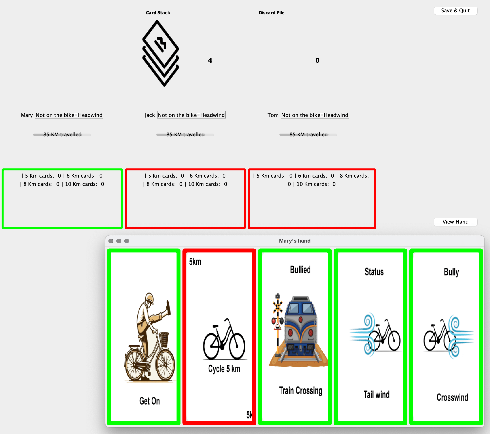

# GetOnGame

GetOnGame is a Java-based recreation of the classic Dutch card game "Stap Op" developed as a Software Engineering course project. The game simulates a 100 km cycling journey where players aim to complete specific routes while hindering their opponents' progress.



## Project Overview

This project was executed by a team of 10 students. During this projects, the team focused on:

- **Agile Collaboration**: The project was developed by a team of 10 members using Agile methodologies, emphasizing iterative development and continuous feedback.

- **Object-Oriented Design**: The game components were modeled using object-oriented principles to ensure modularity and maintainability.

- **Test-Driven Development (TDD)**: Development followed TDD practices, with comprehensive unit tests ensuring code reliability.


## Game Overview

In "Stap Op" players embark on four cycling trips totaling 100 km. The objective is to complete the following routes:
- **8×5 km (40 km)**: To the woods
- **4×6 km (24 km)**: To the moors
- **2×8 km (16 km)**: To the lakes
- **2×10 km (20 km)**: To the sea

The game consists of 99 cards:

- **14 Get-On**
- **4 Headwind**
- **5 Tailwind**
- **3 Criss-Cross**
- **8 Barrier Open**
- **3 Flat Tire**
- **8 Bike Repair**
- **2 Youth Hostel**
- **24 × 5 km**
- **12 × 6 km**
- **8 × 8 km**
- **8 × 10 km**

## How to Play

1. **Setup**: Upon game initialisation, the deck of cards are shuffled and each player is dealt five cards. The remaining cards form the draw pile.

2. **Gameplay**: Players take turns clockwise. On their turn, a player draws one card from the draw pile and then plays one card, choosing to:
   - Place a card in front of themselves.
   - Play a hindrance card on an opponent.
   - Discard a card to the discard pile.

3. **Movement Conditions**:
   - A "Get-On" card is required to start playing kilometer cards.
   - To play 8 km or 10 km cards, a "Tailwind" card must be active.
   - Hindrance cards (e.g., "Flat Tire") must be countered with the appropriate remedy (e.g., "Bike Repair") before proceeding.

4. **Winning**: The first player to complete exactly 8×5 km, 4×6 km, 2×8 km, and 2×10 km wins the game.

For detailed rules, refer to this [Stap Op overview](https://www.holland-cycling.com/blog/261-stap-op-a-classic-dutch-card-game).


## Getting Started

To run the game locally:

1. **Clone the Repository**:
   ```bash
   git clone https://github.com/gabrieletijunaityte/GetOnGame.git
   ```
2. **Navigate to the Project Directory**:
   ```bash
   cd GetOnGame
   ```
3. **Compile the Code**:
   ```bash
   javac -cp "lib/json-simple-1.1.1.jar" -d bin src/game/*.java src/logic/*.java src/utilities/*.java src/graphics/*.java
   ```
4. **Run the Game**:
   ```bash
   java -cp "bin:lib/json-simple-1.1.1.jar" game.Game
   ```

## Contributions

This project was collaboratively developed by a team of 10 students as part of a Software Engineering course. Contributions were made through pair programming sessions, code reviews, and continuous integration practices.

## Acknowledgments

We extend our gratitude to our course instructors and peers for their support and feedback throughout the development process. Special thanks to the creators of the original "Stap Op" game for inspiring this project. 
